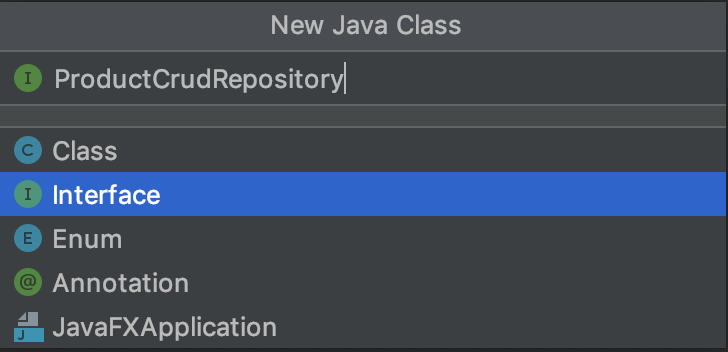

# Workshop Springboot Tutorial

## Crear proyecto Springboot

Para crear el esqueleto del proyecto Springboot lo mas facil es utilizar la herramienta online de
`Spring Initializr`.

Para ello debemos acceder a la siguiente URL: https://start.spring.io/

Para este workshop llenaremos el formulario con la siguiente información:


### Dependencias

Vamos a seleccionar la siguientes dependencias:
* `Spring WEB` la cual proveera todas las clases para crear servicios web
* `Spring Data JPA` (Java Persistance API) para trabajar con los accesos a base de datos
* `H2 Database` lo que nos permitirá crear una base de datos en memoria
* `Lombok` Ayuda con algunas de las molestias de Java, cosas como generar getters y setters con anotaciones y mucho mas


Para finalizar precionaremos el botoón Generate el cual nos descargará un ZIP con el proyecto el cual
vamos a descomprimir en una carpeta a elección 


## Importar proyecto

Para este workshop o cualquier proyecto Java que te toque trabajar recomendamos usar IntelliJ IDEA, el cual cuenta
con una versión Community que es gratuita y lo puedes descargar en la siguiente URL: https://www.jetbrains.com/idea/
 
Si bien puedes abrir el proyecto en cualquier IDE o editor de texto, asumiremos para el resto del workshop que
estas utilizando el que te hemos recomendado.
 
### Abrir IntelliJ IDEA

Al ejecutar el IDE te encontraras con una ventana similar a esta:


Seleccionar la carpeta que haz descompimido con el esqueleto del proyecto


Una vez que se ha terminado de importar el proyecto y descargar las dependencias, deberiamos tener una estructura
como sigue:


## Manos a la Obra!

Comenzaremos a crear nuestro poyecto de abajo hacia arriba (desde la capa de datos al servicio)

### Capa de datos

#### Configuración

Dado que hemos incluido la dependencia de H2 en nuestro proyecto, Spring detectara automaticamente que es
esta la base de datos que vamos a usar.

Para disponer de una consola web donde podamos manupularla y ademas activar que nos muestre por consola el
codigo SQL que va generando debemos agregar las siguientes lineas en el archivo 
`src/main/resources/application.properties`

```properties
# Enabling H2 Console
spring.h2.console.enabled=true
spring.jpa.properties.hibernate.show_sql=true
```

#### Entity

Ahora vamos a crear un `Entity` que represente un `Producto` en nuestra base de datos. Una buena practica en
Java es que hagamos todo en ingles, por lo que lo vamos a llamar `ProductEntity` y lo vamos a colocar en un 
paquete apropiado que llamaremos `entity` (Otra buena practica en Java es que usemos siempre singular, tanto
para nombrar clases como tambien paquetes).

Primero creamos el package el cual dejaremos dentro de `cl.continuum.product`


Luego creamos la clase Entity:


Agregaremos a nuestra clase las siguientes anotaciones:
* `@Entity` con lo cual Spring podrá identificar la clase como un `Entity`
* `@ToString` de `Lombok` nos va a generar una sobre carga del metodo toString de `java.lang.Object` en el cual
incluira todas las propiedades del objecto en la salida
* `@Getter` & `@Setter` de `Lombok` nos van a generar todo el código con los setter y getters de cada
propiedad del Bean
* `@AllArgsConstructor` de `Lombok` nos proveera de un cosntructor de clase que solicitara cada una de
las propiedades del Bean
* `@NoArgsConstructor` de `Lombok` nos proveera de un constructor por defecto (sin ningun parámetro)

Agregaremos en nuestro entity las propiedades que queremos que contenga la tabla `product` en base de datos
y crearemos una propiedad llamada `id` que será númerica la cual indicaremos mediante la anotación de JPA `@Id`
que será la llave de nuestra tabla. Adicionalmente usando la anotación de JPA `@GeneratedValue` le indicaremos
que esta llave se ira auto incrementando, por lo que nosotros no debemos preocuparnos de llenarla.

Nuestra clase debería verse asi cuando este lista:

```java
package cl.continuum.product.entity;

import lombok.*;

import javax.persistence.Entity;
import javax.persistence.GeneratedValue;
import javax.persistence.Id;
import java.time.LocalDateTime;

@NoArgsConstructor
@AllArgsConstructor
@Setter
@Getter
@ToString
@Entity
public class ProductEntity {
    @Id
    @GeneratedValue
    private Long id;
    private String name;
    private Long price;
    private LocalDateTime created;
    private LocalDateTime updated;
}
```

#### Repository

Los repository son interfaces que nos provee Spring para simplificar el uso de los Entity y las operaciones
que podemos relizar sobre ellos.

Para este workshop vamos a utilizar especificamente la interfaz `CrudRepository`, la que nos provee listas todas las
operaciones de `CRUD` sobre una tabla o Entity.

Creamos el package `repository` dentro de `cl.continuum.product` y luego cramos la clase `ProductCrudRepository` dentro
del package que acabamos de crear. Esta vez debemos seleccionar la opción `Interface` en el menú.



Luego debemos hacer que esta interface extienda la interface de Spring `CrudRepository` la que nos proveera de las
operaciones basicas de `CRUD` sobre la tabla `product` a travez de nuestro entity `ProductEntity` con tan solo
indicarselo en sus tipos genericos:

```java
public interface ProductCrudRepository extends CrudRepository<ProductEntity, Long>
```

Dado que su llave primaria la hemos definido de tipo `Long` es que le hemos indicado en su segundo tipo generico este
tipo de dato.

Una de las operaciones que debemos realizar para el funcionamiento de nuestro servicio será la de buscar productos por
nombre, para lo cual querremos hacer un `LIKE` sobre el campo `name` en la tabla producto. Esta operación si bien no
viene ya lista en la interfaz de Spring, dado que no tiene como conocer cada nombre que podriamos tener en nuestras tablas,
crearla es muy sencillo, basta con que declaremos el siguiente metodo en nuestra interfaz:

```java
List<ProductEntity> findByNameLike(String name);
```

Con esto Spring sabe que lo que debe hacer cuando invoquemos este campo es crear una consulta como esta:

```sql
select * from product p where p.name like '${name}'
```

donde `${name}` será lo que le entreguemos como parametro al metodo.

Ya terminada nuestra interfaz debería lucir asi:

```java
package cl.continuum.product.repository;

import cl.continuum.product.entity.ProductEntity;
import org.springframework.data.repository.CrudRepository;

import java.util.List;

public interface ProductCrudRepository extends CrudRepository<ProductEntity, Long> {
    List<ProductEntity> findByNameLike(String name);
}
```

#### Modelo

El modelo son los objetos que usualmente usaremos para transaportar informacion desde y hacia nuestro servicio. Es
bastante comnún que podamos tener una clase modelo que represente la información que tenemos en un entity, dado que el
modelado de datos de nuestra base de datos muchas veces coincide con el modelo de información que nuestro servicio hará
transitar. Esta no será la excepción y vamos a crear una clase de prodelo que llamaremos `Product`.

Antes de crear nuestra clase vamos a crear el package `model` dentro del package `cl.continuum.product` y luego creamos
nuestra clase dentro del package que hemos creado recien.

Nuestra clase deberá verse así:

```java
package cl.continuum.product.model;

import lombok.*;

import javax.validation.constraints.*;
import java.util.List;

@NoArgsConstructor
@AllArgsConstructor
@Setter
@Getter
@ToString
public class Product {
    private Long id;

    @NotEmpty(message = "Please provide a name")
    @Size(min=3, max=200)
    private String name;

    @NotNull(message = "Please provide a price")
    @Min(1)
    @Max(1000000)
    private Long price;

    private List<Rating> detail;
}
```

Dado que este es un Bean usaremos nuevamente las anotaciones de `Lombok` que ya hemos descrito previamente.

Lo nuevo que vemos en esta clase son las anotaciones `@NotEmpty`, `@Size`, `@NotNull`, `@Min` y `@Max` las cuales son
constrains de Java que nos facilitaran las validación automatica de dichas propiedades.

Adicionalmente vamos a necesitar un modelo llamado `Rating` el cual nos servira para interactuar con el servicio externo
que provee información extra de cada producto. Este modelo deberá verse como sigue:

```java
package cl.continuum.product.model;

import lombok.*;

@NoArgsConstructor
@AllArgsConstructor
@Setter
@Getter
@ToString
public class Rating {
    private Long id;
    private String productName;
    private Integer rating;
    private Integer commentsCount;
    private Long price;
    private String ecommerce;
}
```
