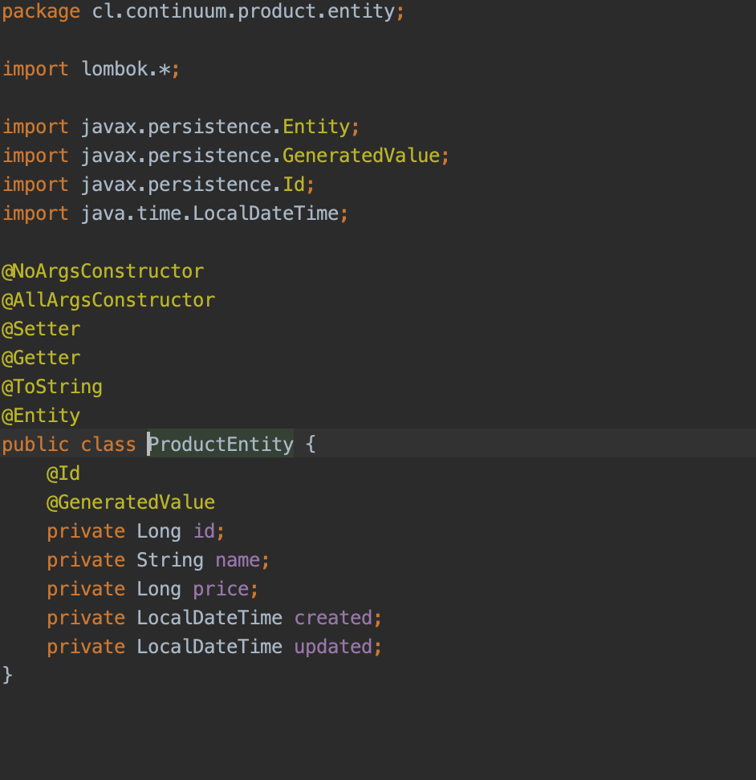
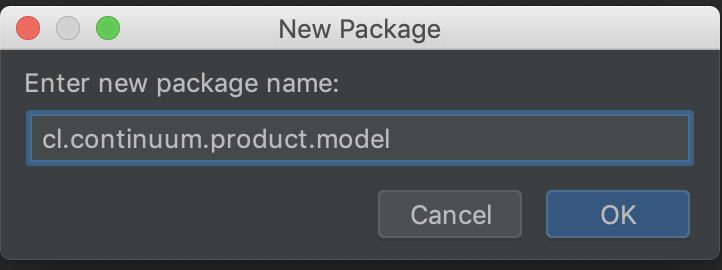

# Workshop Springboot Tutorial

## Crear proyecto Springboot

Para crear el esqueleto del proyecto Springboot lo mas facil es utilizar la herramienta online de
`Spring Initializr`.

Para ello debemos acceder a la siguiente URL: https://start.spring.io/

Para este workshop llenaremos el formulario con la siguiente información:

### Dependencias

Vamos a seleccionar la siguientes dependencias:
* `Spring WEB` la cual proveera todas las clases para crear servicios web
* `Spring Data JPA` (Java Persistance API) para trabajar con los accesos a base de datos
* `H2 Database` lo que nos permitirá crear una base de datos en memoria
* `Lombok` Ayuda con algunas de las molestias de Java, cosas como generar getters y setters con anotaciones y mucho mas

Para finalizar precionaremos el botoón Generate el cual nos descargará un ZIP con el proyecto el cual
vamos a descomprimir en una carpeta a elección 

Para este workshop recomendamos usar IntelliJ IDEA, pero puedes usar el IDE de tu preferencia para abrir el projecto generado por Spring Initializr
 
Abrir IntelliJ

Seleccionar la carpeta descomprimida del proyecto generado

Luego que el IDE termine de importar el proyecto y descargar las dependencias, nuestro proyecto deberia verse como la imagen de abajo

### Manos a la Obra

crear package entity

crear class entity

crear package model

crear class entity

