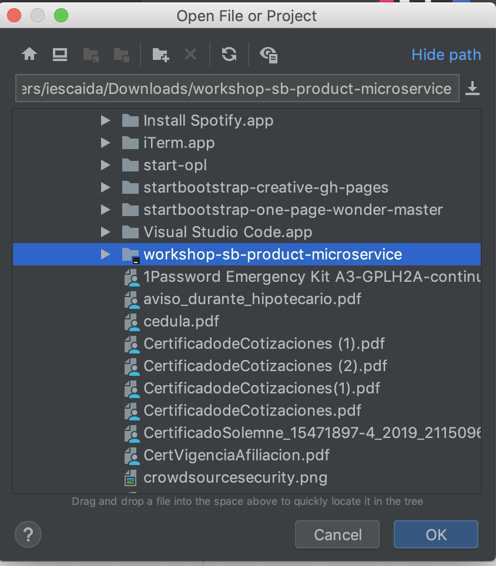

# Workshop Springboot Tutorial

## Crear proyecto Springboot

Para crear el esqueleto del proyecto Springboot lo mas facil es utilizar la herramienta online de
`Spring Initializr`.

Para ello debemos acceder a la siguiente URL: https://start.spring.io/

Para este workshop llenaremos el formulario con la siguiente información:


### Dependencias

Vamos a seleccionar la siguientes dependencias:
* `Spring WEB` la cual proveera todas las clases para crear servicios web
* `Spring Data JPA` (Java Persistance API) para trabajar con los accesos a base de datos
* `H2 Database` lo que nos permitirá crear una base de datos en memoria
* `Lombok` Ayuda con algunas de las molestias de Java, cosas como generar getters y setters con anotaciones y mucho mas


Para finalizar precionaremos el botoón Generate el cual nos descargará un ZIP con el proyecto el cual
vamos a descomprimir en una carpeta a elección 


## Importar proyecto

Para este workshop o cualquier proyecto Java que te toque trabajar recomendamos usar IntelliJ IDEA, el cual cuenta
con una versión Community que es gratuita y lo puedes descargar en la siguiente URL: https://www.jetbrains.com/idea/
 
Si bien puedes abrir el proyecto en cualquier IDE o editor de texto, asumiremos para el resto del workshop que
estas utilizando el que te hemos recomendado.
 
### Abrir IntelliJ IDEA

Al ejecutar el IDE te encontraras con una ventana similar a esta:


Seleccionar la carpeta que haz descompimido con el esqueleto del proyecto



Una vez que se ha terminado de importar el proyecto y descargar las dependencias, deberiamos tener una estructura
como sigue:


## Manos a la Obra!

Comenzaremos a crear nuestro poyecto de abajo hacia arriba (desde la capa de datos al servicio)

### Capa de datos

#### Configuración

Lo primero que haremos será indicarle a Spring que nuestra percistencia sera en una base de datos H2, para
lo cual debemos agregar la siguientes lineas en el archivo `src/main/resources/application.properties`


```properties
# Enabling H2 Console
spring.h2.console.enabled=true
spring.jpa.properties.hibernate.show_sql=true
```

#### Entity

Ahora vamos a crear un `Entity` que represente un `Producto` en nuestra base de datos. Una buena practica en
Java es que hagamos todo en ingles, por lo que lo vamos a llamar `ProductEntity` y lo vamos a colocar en un 
paquete apropiado que llamaremos `entity` (Otra buena practica en Java es que usemos siempre singular, tanto
para nombrar clases como tambien paquetes).

Primero creamos el package el cual dejaremos dentro de `cl.continuum.product`


Luego creamos la clase Entity:


